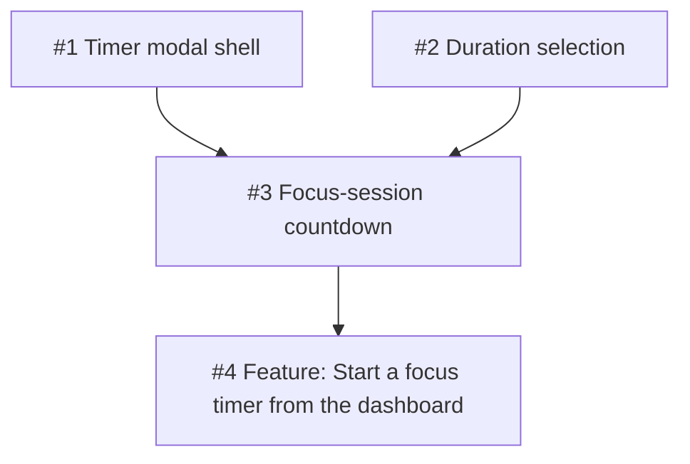

# Creating the GitHub issues

The issue bodies are ready in [`issue-drafts`](issue-drafts). An authenticated
agent should create the issues in numeric order, using each file's heading as
the title and remaining content as the body.

After GitHub assigns issue numbers:

1. Set issue 3 as **blocked by** issues 1 and 2.
2. Set issue 4 as **blocked by** issue 3.

The final graph should be:

Use the repository's **Issues** page and the issue dependency control to add
the blocked-by relationships; do not merely add textual links.
